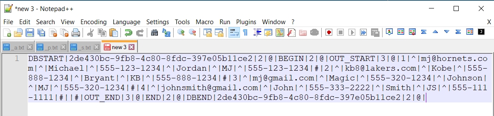
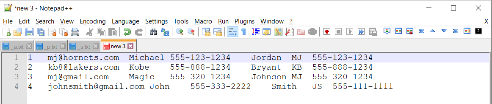

# Boomi Tools

## Notepad++ Macros

To view Database output, two macros are available and allow you to:

1. View Data: separate the information formatted by the Database profile to view the Dell Boomi technical information and the Database data
2. View in Excel: format the information from the Database profile to have a view in Excel

### Installation

Copy shortcuts.xml contained in the Notepad++ directory in github 

[]: Notepad++/shortcuts.xml?raw=true	"macros"

to your %appdata%\Notepad++ folder and restart Notepad++

### Steps

Execute a process or use process reporting to locate a DB operation which return data formatted in Database Profile.

Execute the process

Download or copy the document

Paste or open the document in Notepad++

Select one the of the Dell Boomi Macros in Notepad++

You will get the formatted data

